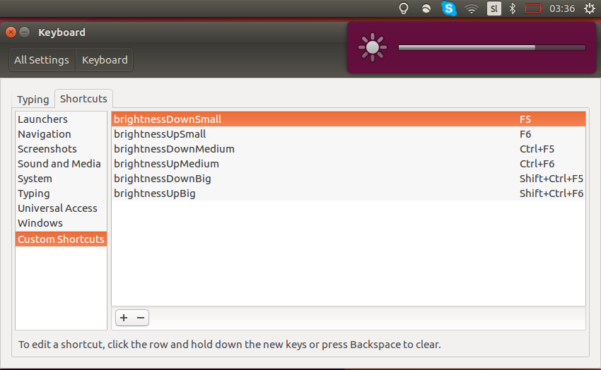

# linuxBrightnessControl
Script to control screen brightness for Linux

If your machine does not support native keyboard brightness control, this script can be binded as a custom hotkey.

## Configure

To use the script, some configuration is needed. Run the commands bellow in the shell, from the directry containing the scripts.

```bash
sudo chmod u+x config.sh
./config.sh
```

The script will (optionally) also execute the ```set_hotkeys.py``` script, that will create keyboard shortcuts according to the ```keys.config``` file.

The added hotkeys can be found in ```System Settings -> Keyboard -> Shortcuts -> Custom Shortcuts```



### Example: Default keybindings in keys.config

The format of a line in the file is
```name factor key_comb``` where
* name: Name of the command
* factor: Factor by which the current brightness is to be multiplied
* key_comb: The hotkey combination to be used

The default bindings in the ```keys.config``` are
  
>brightnessDownSmall 0.9 F5  
>brightnessUpSmall 1.1 F6  
>brightnessDownMedium 0.75 <Control>F5  
>brightnessUpMedium 1.25 <Control>F6

You can change the contents of the ```keys.config``` file to the bindings of your choosing.

## Lone use of script

To decrease the brightness by a factor of x (0.9 in the bellow example) run

```bash
./brightness.sh 0.9
```

To increase the brightness by a factor of x (1.1 in the bellow example) run

```bash
./brightness.sh 1.1
```
